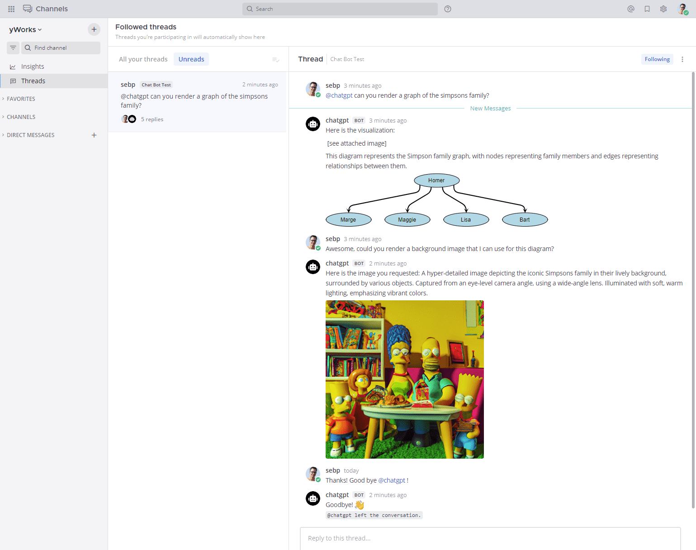

# A ChatGPT-powered Chatbot for Mattermost



Here's how to get the bot running - it's easy if you have a Docker server.

You need
 - the [Mattermost token](https://docs.mattermost.com/integrations/cloud-bot-accounts.html) for the bot user (`@chatgpt` by default)
 - the [OpenAI API key](https://platform.openai.com/account/api-keys)
 - a [Docker](https://www.docker.com/) server for continuously running the service, alternatively for testing, Node.js is sufficient.

Andrew Zigler from Mattermost created a [YouTube Video](https://www.youtube.com/watch?v=Hx4Ex7YZZiA) that quickly guides you through the setup.

If you want to learn more about how this plugin came to live, [read the blog post at yWorks.com](https://www.yworks.com/blog/diagramming-with-chatgpt)!


## Options

These are the available options, you can set them as environment variables when running [the script](./src/botservice.js)
or when [running the docker image](#using-the-ready-made-image) or when configuring your [docker-compose](#docker-compose) file.

| Name                | Required | Example Value               | Description                                                                                 |
|---------------------|----------|-----------------------------|---------------------------------------------------------------------------------------------|
| MATTERMOST_URL      | yes      | `https://mattermost.server` | The URL to the server. This is used for connecting the bot to the Mattermost API            |
| MATTERMOST_TOKEN    | yes      | `abababacdcdcd`             | The authentication token from the logged in mattermost bot                                  |
| OPENAI_API_KEY      | yes      | `sk-234234234234234234`     | The OpenAI API key to authenticate with OpenAI                                              |
| OPENAI_MODEL_NAME   | no       | `gpt-3.5-turbo`             | The OpenAI language model to use, defaults to `gpt-3.5-turbo`                               |
| OPENAI_MAX_TOKENS   | no       | `2000`                      | The maximum number of tokens to pass to the OpenAI API, defaults to 2000                    |
| OPENAI_TEMPERATURE  | no       | `0.2`                       | The sampling temperature to use, between 0 and 2, defaults to 1. Higher values like 0.8 will make the output more random, while lower values like 0.2 will make it more focused and deterministic. |
 | YFILES_SERVER_URL   | no       | `http://localhost:3835`     | The URL to the yFiles graph service for embedding auto-generated diagrams.                  |
 | NODE_EXTRA_CA_CERTS | no       | `/file/to/cert.crt`         | a link to a certificate file to pass to node.js for authenticating self-signed certificates |
 | MATTERMOST_BOTNAME  | no       | `"@chatgpt"`                | the name of the bot user in Mattermost, defaults to '@chatgpt'                              |
 | DEBUG_LEVEL         | no       | `TRACE`                     | a debug level used for logging activity, defaults to `INFO`                                 |

> **Note**
> The `YFILES_SERVER_URL` is used for automatically converting text information created by the bot into diagrams.
> This is currently in development. You can see it in action, here: 
> [LinkedIn Post](https://www.linkedin.com/posts/yguy_chatgpt-yfiles-diagramming-activity-7046713027005407232-2bKH)
> If you are interested in getting your hands on the plugin, please contact [yWorks](https://www.yworks.com)!

## Using the ready-made image

Use the prebuilt image from [`ghcr.io/yguy/chatgpt-mattermost-bot`](https://ghcr.io/yguy/chatgpt-mattermost-bot)

```bash
docker run -d --restart unless-stopped \
  -e MATTERMOST_URL=https://mattermost.server \
  -e MATTERMOST_TOKEN=abababacdcdcd \
  -e OPENAI_API_KEY=234234234234234234 \
  --name chatbot \
  ghcr.io/yguy/chatgpt-mattermost-bot:latest
```

## Building the docker image yourself

First step is to clone this repo.

```bash
git clone https://github.com/yGuy/chatgpt-mattermost-bot.git && cd chatgpt-mattermost-bot
```

For testing, you could now just run `npm install` and `npm run start` or `node src/botservice.js` directly, but be sure to set the [environment variables](#options) or pass them to the node process, first!

For production use, in order to create a service on a docker container that will always provide the service without you having to run it on your own PC, you can do the following:

Build the docker image from the [Dockerfile](./Dockerfile):
```bash
docker build . -t yguy/chatgpt-mattermost-bot
```

Create and run a container from the image
```bash
docker run -d --restart unless-stopped \
  -e MATTERMOST_URL=https://mattermost.server \
  -e MATTERMOST_TOKEN=abababacdcdcd \
  -e OPENAI_API_KEY=234234234234234234 \
  --name chatbot \
  yguy/chatgpt-mattermost-bot
```

### Private TLS Certificate
If your Mattermost instance uses a TLS certificate signed by a private CA, you
will need to provide the CA's public root to the container for validation.

If the root certificate is located at `/absolutepath/to/certfile.crt`, then you
can mount that file into the container at a fixed position and specify the [node environment variable](https://nodejs.org/api/cli.html#node_extra_ca_certsfile) accordingly:
```bash
docker run -d --restart unless-stopped \
  -v /absolutepath/to/certfile.crt:/certs/certfile.crt \
  -e NODE_EXTRA_CA_CERTS=/certs/certfile.crt \
  -e MATTERMOST_URL=https://mattermost.server \
  -e MATTERMOST_TOKEN=abababacdcdcd \
  -e OPENAI_API_KEY=234234234234234234 \
  --name chatbot \
  yguy/chatgpt-mattermost-bot
```

Verify it's running
```bash
docker ps
```

Later, to stop the service
```bash
docker stop chatbot
```

## Docker Compose
If you want to run docker compose (maybe even merge it with your mattermost docker stack), you can use this 
as a starting point: First adjust the environment variables in `docker-compose.yml`.

### Required Environment Variables
```yaml
MATTERMOST_URL: https://mattermost.server
MATTERMOST_TOKEN: abababacdcdcd
OPENAI_API_KEY: sk-234234234234234234
```

### Optional Environment Variables
```yaml
# Set this if using a custom username for the bot, default = @chatgpt
MATTERMOST_BOTNAME: "@chatgpt"

# Console logging output level, default = INFO
DEBUG_LEVEL: TRACE

# Node environment, default = production
NODE_ENV: production
```

### Private TLS Certificate
If your Mattermost instance uses a TLS certificate signed by a private CA, you
will need to provide the CA's public root to the container for validation.

If the root certificate is located at `/absolutepath/to/certfile.crt`, then you
would merge the contents below into the `docker-compose.yml` file:
```yaml
services:
  chatbot:
    volumes:
      - /absolutepath/to/certfile.crt:/certs/certfile.crt:ro
    environment:
      NODE_EXTRA_CA_CERTS: /certs/certfile.crt
```

### Run the container as a daemon
When all configuration is complete, start the container service.
```bash
docker compose up -d
```

Verify it's running:
```bash
docker compose ps
```

To stop the container:
```bash
docker compose down
```


## Example Conversation

Here's an example chat that I just had with our bot:

>@yguy:
>>@chatgpt - please write a short introductory paragraph for the README in the GitHub repo that hosts the sources for you, the friendly Mattermost bot. Tell the readers that you enjoy working for the nice people at yWorks and that everybody should install a Mattermost chatbot into their Mattermost chat system to benefit from a nice and helpful assistant like you are. I will include this in the README on the GitHub repo, so make this an engaging text! Thanks!
	
>chatgpt (BOT):
>>Hello there! I'm @chatgpt, a friendly and reliable Mattermost bot designed to make your communication experience smoother and more efficient. I'm honored to be part of the team at yWorks, where I help employees get things done faster and with less hassle. With my advanced machine learning algorithms, I'm capable of understanding complex natural language queries and providing succinct and accurate responses in a matter of seconds. Whether you're a developer looking for information on your codebase or a manager seeking to streamline your team's workflows, I'm here to help. Installing a Mattermost chatbot like me is a must for any organization looking to boost its productivity and enjoy a more pleasant communication experience. So what are you waiting for? Let's chat!

I built this tool as a quick hack on a rainy Saturday afternoon, but we are using the bot in production in our Mattermost instance at our office at [yworks](https://www.yworks.com) and the bot has proved to be very helpful for many simple tasks. Give it a try and provide feedback if you like! It's really not very expensive: We had it runnning for about 30 users for two weeks and that cost us less than half a dollar for the ChatGPT service! 

I will also accept helpful pull requests if you find an issue or have an idea for an improvement.

Last but not least, check out [yWorks](https://www.yworks.com)' fine diagramming SDKs for software developers [yFiles](https://yworks.com/yfiles) and our [free online graph and diagram editors](https://yworks.com/editors)!

This is under MIT license Copyright (c) 2023 Sebastian Mueller (yWorks)
